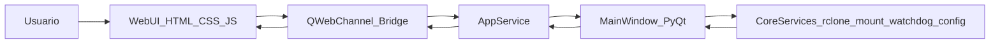
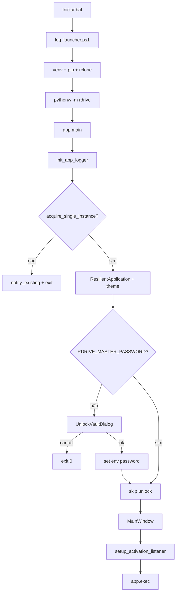

# RDrive — Arquitetura

## 1. Visão geral

RDrive é um orquestrador desktop inspirado no RaiDrive. O shell é **PyQt6** (janela frameless, bandeja, single-instance, cofre); a **interface principal** vive em **`Static/`** (HTML/CSS/JS) e é servida via **QWebEngine + QWebChannel** — padrão com `RDRIVE_WEBUI=1` (ou omitida, como em `Iniciar.bat`).

- **`Static/`** — UI canónica (lista de drives, adicionar unidade, definições, atividade, TeraBox no frontend).
- **`src/rdrive/ui/`** — apenas shell + bridge + diálogos nativos pontuais (cofre, reset de senha, transferências stripe, browser TeraBox embutido, chrome da janela). Não duplica ecrãs completos em PyQt no arranque.
- **UI nativa PyQt6** (legada) — só com `RDRIVE_WEBUI=0` ou quando `PyQt6-WebEngine` falha; páginas `widgets/` / `settings/` são carregadas **lazy** nesse modo.

O backend de montagem é **rclone mount**, que expõe remotes na cloud como unidades locais via **WinFsp** (Windows) ou **FUSE3** (Linux). A aplicação gere o ciclo de vida das montagens, estado persistente (com cofre opcional), logs duplos e uma UI premium com chrome frameless no Windows.

Camadas:

- `Static/` — frontend HTML/CSS/JS (UI principal)
- `ui/` — shell PyQt6: `main_window`, tray, cofre; `web/` (bridge); `chrome/`; `dialogs/` e `terabox/` (modais); `widgets/` + `settings/` só no fallback nativo
- `models/` — dados de domínio (`Drive`, estados)
- `core/` — serviços por domínio (`vault/`, `rclone/`, `cloud/`, `mount/`, `stripe/`, `logging/`, `runtime/`, …); raiz limpa — só `__init__.py` + subpastas

## 2. Estrutura de pastas

```
RDrive/
├── Iniciar.bat              # launcher Windows principal (venv, deps, rclone, pythonw)
├── Static/                  # WebUI HTML/CSS/JS (fonte única)
│   ├── index.html
│   ├── script.js
│   ├── css/
│   └── providers/           # SVGs espelhados (sync_static_providers.py)
├── scripts/
│   ├── launchers/           # .bat especializados (TeraBox, DevStatic, …)
│   └── log_launcher.ps1     # tee do output do batch → logs/launcher.log
├── logs/                    # logs do projeto (dev); rotacionados
├── docs/
│   └── ui-reference.md      # referência UX detalhada
└── src/rdrive/
    ├── app.py               # entry point PyQt6
    ├── __main__.py          # python -m rdrive
    ├── assets/providers/    # SVG por backend rclone
    │   ├── cloud/           # Drive, Dropbox, OneDrive, …
    │   ├── storage/         # S3, GCS, Azure Blob, …
    │   ├── protocol/        # WebDAV, SFTP, FTP, …
    │   ├── local/           # local
    │   └── _fallback/       # ícone genérico
    ├── core/                # serviços (subpastas por domínio; raiz = __init__.py apenas)
    │   ├── __init__.py      # re-export opcional: ConfigStore, VaultState
    │   ├── vault/           # cofre, config_store, unlock
    │   ├── rclone/          # CLI rclone, proxy
    │   ├── cloud/           # OAuth, remote_setup, terabox
    │   ├── mount/           # mount_manager, letras, validação
    │   ├── stripe/          # upload stripe, quota, transferências
    │   ├── logging/         # app_logger, human_log, error_hub
    │   ├── runtime/         # single_instance, restart, subprocess
    │   ├── profile/         # utilizador, sessão, recovery OTP
    │   ├── paths/           # resolve_project_root
    │   ├── diagnostics/     # checks sistema/remotes
    │   └── cleanup/         # limpeza segura de cache
    ├── models/              # drive.py
    └── ui/                  # shell PyQt6 (WebUI em Static/)
        ├── main_window.py
        ├── chrome/          # tema, frameless, botões
        ├── web/             # web_shell, web_bridge, app_service
        ├── dialogs/         # assistentes e modais
        ├── widgets/         # lista de drives, providers, activity
        ├── settings/        # tabs de definições
        ├── foundation/      # ícones, text_selection
        └── terabox/         # captura de cookie Terabox
```

Dados de runtime (fora do repositório): `platformdirs.user_data_dir("RDrive")` — `users/<profile>/state/`, `cache/`, `stripe_wal/`, etc.

## 3. Multi-utilizador

Cada email normalizado (`lower().strip()`) mapeia para um perfil `user_<sha256[:16]>` com estado isolado:

```
%LOCALAPPDATA%/RDrive/RDrive/
├── users/
│   ├── recent.json              # últimos 5 emails (não criptografado)
│   ├── default/
│   │   ├── state/               # migração automática do state/ legado
│   │   │   ├── drives.enc
│   │   │   └── settings.enc
│   │   └── recovery_profile.json
│   └── user_<hash>/
│       ├── state/
│       └── recovery_profile.json
└── state/                       # legado — migrado para users/default/ no arranque
```

Variáveis de ambiente por sessão: `RDRIVE_USER_EMAIL`, `RDRIVE_ACTIVE_PROFILE_ID`, `RDRIVE_MASTER_PASSWORD`, `RDRIVE_WEBUI` (`0`/`false` força UI nativa; omitido ou `1` = WebUI), `RDRIVE_STATIC_DIR` (pasta `Static/`), `RDRIVE_STATIC_LIVE=1` (dev: serve `Static/` in-place com reload), `RDRIVE_PROJECT_ROOT`.

## 3.b WebUI embutida (HTML/CSS/JS)

A interface premium é renderizada por um `QWebEngineView` carregando **`Static/`** (ou cópia em `%LOCALAPPDATA%/RDrive/webui/static-1/`). Com `RDRIVE_WEBUI=1` (padrão via `Iniciar.bat`):



Componentes:

- `Static/index.html` + `css/` + `script.js` — design tokens centralizados (`var(--*)`), grid travado e responsivo, switches deslizantes nativos, pills com glow.
- `ui/web/app_service.py` — adapta comandos JS para operações em `MainWindow` (drives, settings, toasts, eventos).
- `ui/web/web_bridge.py` — `QObject` registado no `QWebChannel` como `rdrive`; expõe `dispatch(commandJson) → str` e sinais `event(str)` / `state(str)`.
- `ui/web/web_shell.py` — `QWidget` central que copia `Static/` para cache webui (ou serve in-place em live), materializa logos de provedor como `providers/<slug>.svg` e carrega `index.html` via `file://`.
- `scripts/sync_static_providers.py` — espelha SVGs de `assets/providers/` para `Static/providers/` (preview browser e git).

Contrato de comandos atual:

- `getInitialState` — força snapshot completo (`state`).
- `openAddDrive`, `openSettings` — navega o stack PyQt para os assistentes nativos.
- `toggleConnection {id, turnOn}`, `setStartup {id, enabled}`.
- `editDrive {id}`, `deleteDrive {id}`, `refresh`.
- `listCombinableDrives {primary_id?}` / `createCombinedDrive {primary_id, peer_ids[], label, mountpoint, connect_now}` — fluxo «Combinar nuvens» (botão na toolbar, view `view-combine`); só junta drives do mesmo provedor canónico (mesmo backend rclone), recusa wrappers e uniões aninhadas (`rdrive.core.cloud.combine_drives`).

Eventos push (`event`):

- `drives`, `integrity`, `status_text` (atualizados após cada `_refresh_table`).
- `activity` (replica `human_log` no painel lateral).
- `toast` para feedback transitório.

Quando `PyQt6-WebEngine` está ausente, `RDRIVE_WEBUI=0`, ou `Static/` não é encontrado, a janela cai automaticamente na UI nativa antiga (sem regressão de fluxo).

Fluxo: arranque tenta `session_store` (DPAPI, `%LOCALAPPDATA%/RDrive/session/`) → se falhar, `UnlockVaultDialog` (email + senha + opcional **Manter sessão iniciada**) → perfil → `ConfigStore(profile_id)` → `MainWindow`. Em **Definições → Segurança**, **Terminar sessão neste dispositivo** limpa a sessão memorizada; **Mudar utilizador** reinicia sem credenciais em memória.

## 4. Fluxo de arranque



### 4.1 Optimizações de arranque (perf-pass)

`Iniciar.bat` evita trabalho redundante em arranques quentes:

- **Pip cache por hash** — calcula SHA1 de `requirements.txt`; salta `pip install`
  enquanto o hash bater (stamp `.venv\.pip-stamp`). Força reinstall:
  `set RDRIVE_FORCE_PIP=1`.
- **WebEngine verify cache** — `scripts\verify_webengine.ps1` lança uma
  `QApplication` (~5-8 s). Cacheamos o último OK por 7 dias e quando o
  `LastWriteTime` da pasta `.venv\Lib\site-packages\PyQt6` não mudou
  (stamp `.venv\.webengine-stamp`, `-SkipNetwork`). Forçar:
  `set RDRIVE_FORCE_WEBENGINE_VERIFY=1`.
- **Bootstrap extensão cookies** — `bootstrap_cookies_extension.ps1` já
  short-circuit em ~50 ms quando `tools\get-cookies-txt-locally\manifest.json`
  existe.

`MainWindow.__init__` adia trabalho não-crítico:

- `QTimer.singleShot(0, _deferred_startup_checks)` — verificação rclone ao arranque (sem montagem automática).
- `QTimer.singleShot(800, _setup_periodic_cleanup)` — limpeza segura.
- `QTimer.singleShot(1200, _setup_reliability_scan)` — varredura stripe.
- `QTimer.singleShot(2500, _setup_watchdog_deferred)` — baseline do watchdog
  (1k+ ficheiros) sai do hot path do primeiro paint.
- `_refresh_table()` só executa em modo nativo no `__init__`; a `WebShell`
  empurra o snapshot via `push_full_state(defer_integrity=True)` em
  `loadFinished`, evitando varrer manifests stripe antes do primeiro paint.
  O integrity real chega ~100 ms depois como evento `integrity_snapshot`.

O handler de diálogos críticos (`_show_critical_error_dialog`) deduplica
mensagens idênticas por 30 s e agrega rajadas num único diálogo informativo,
evitando o "spam" característico de cascatas de exceções no watchdog.

## 4. Módulos core

**Imports canónicos (obrigatório em código novo):** `rdrive.core.<pacote>.<módulo>`

| Pacote | Exemplo | Responsabilidade |
|--------|---------|------------------|
| `vault` | `rdrive.core.vault.config_store` | Cofre, persistência encriptada, unlock |
| `rclone` | `rdrive.core.rclone.rclone` | Wrapper CLI (`RcloneCli`), proxy HTTP |
| `cloud` | `rdrive.core.cloud.auto_connect` | OAuth, remote setup, TeraBox, **combinar nuvens** (`combine_drives` → rclone union) |
| `mount` | `rdrive.core.mount.mount_manager` | Montagens rclone, letras, validação |
| `stripe` | `rdrive.core.stripe.stripe_engine` | Upload stripe, quota, transferências |
| `logging` | `rdrive.core.logging.app_logger` | Logs técnico/humano, error hub |
| `runtime` | `rdrive.core.runtime.single_instance` | Instância única, restart, subprocess |
| `profile` | `rdrive.core.profile.user_profile` | Multi-utilizador, sessão, OTP |
| `paths` | `rdrive.core.paths.project_paths` | `resolve_project_root` |
| `diagnostics` | `rdrive.core.diagnostics.diagnostics` | Checks sistema/remotes |
| `cleanup` | `rdrive.core.cleanup.cleanup_manager` | Limpeza segura de cache |

O `core/__init__.py` reexporta apenas `ConfigStore` e `VaultState` por conveniência; **não** existem shims na raiz (`rdrive.core.config_store` etc. foram removidos).

| Módulo | Responsabilidade |
|--------|------------------|
| `vault/vault.py` | Cofre simétrico AES-GCM (PBKDF2); encripta `drives.enc` / `settings.enc` |
| `vault/config_store.py` | Persistência atómica; migração plain→encrypted; CRUD drives/settings |
| `runtime/watchdog_service.py` | Thread de saúde: rede, mounts, alterações no código do projeto |
| `logging/app_logger.py` | Log técnico rotativo (`rdrive.log`) |
| `logging/human_log.py` | Log humano PT (`human.log`); feed opcional para UI |
| `runtime/single_instance.py` | Mutex `Global\RDrive_SingleInstance` (Win) ou flock (Linux); `QLocalServer` |
| `mount/drive_letters.py` | Estado A–Z via `GetLogicalDrives` (Win); no-op em Linux |
| `mount/mount_manager.py` | Subprocessos `rclone mount`; cache VFS; Windows: disco local (`--volname`) ou `--network-mode` via `mount_as_local_drive`. Flags de performance afinadas em `build_mount_command_args` (`--checkers 16`, `--transfers 8`, `--vfs-fast-fingerprint`, `--log-level NOTICE`, `--dir-cache-time 30m`); opcional `fast_transfer_mode` eleva buffers/read-ahead/concorrência; opcional `fast_delete_mode` adiciona `--no-checksum`, `--no-modtime`, `--vfs-write-back 5s` |
| `runtime/subprocess_utils.py` | `run_logged` / `popen_logged` com `CREATE_NO_WINDOW` + `STARTUPINFO` SW_HIDE; log DEBUG para consola visível |
| `rclone/rclone.py` | Wrapper CLI (`RcloneCli`); config, remotes, OAuth authorize |
| `cloud/auto_connect.py` | Conexão automática estilo RaiDrive (`AutoConnectService`) |
| `profile/password_reset.py` | OTP 6 dígitos, token de recovery, verificação limitada |
| `profile/email_service.py` | Envio SMTP do OTP; fallback dev → `logs/password_reset_otp.log` |

| `stripe/quota_monitor.py` | `rclone about`; espaço disponível = livre − reservas − margem 500 MB |
| `stripe/reservation_ledger.py` | Reservas persistentes em `state/quota_reservations.json` (pending/active/released) |

**Prealocação (`enable_preallocation`, default `true`):** definida em **Definições → Geral** (não exige aceitação de risco). Quando ligada, o fluxo stripe consulta `total_reserved()` por remote, planeia com `reserve_bytes` e regista reservas activas antes do upload; bloqueios por quota geram entrada em `human.log` via `log_user_event`. Stripe, union pool e modo experimental permanecem na tab **Por sua conta e risco**.

Outros módulos core (stripe, cleanup, recovery, autostart, etc.) mantêm-se como serviços auxiliares documentados no código.

## 5. UI

| Componente | Ficheiro | Notas |
|--------------|----------|-------|
| Janela principal | `main_window.py` | `QStackedWidget`: lista, adicionar, definições, editar; toolbar; chrome infinito |
| Painéis embutidos | `new_drive_dialog.py` (`NewDrivePanel`), `settings_dialog.py` (`SettingsPanel`), `edit_drive_dialog.py` (`EditDrivePanel`) | Fluxos principais sem `QDialog` modal |
| Chrome infinito | `window_chrome.py` | `InfiniteBorderMainWindow`: borda animada (gradiente cónico), title bar custom, `WM_NCHITTEST` |
| Tema | `theme.py` | Tokens escuros, QSS, DWM dark mode, cantos arredondados Win |
| Grelha providers | `provider_grid.py` | Seleção por backend; abas Pessoal/Empresarial |
| Ícones | `provider_icons.py` + `assets/providers/` | Resolução via `importlib.resources` |
| Diálogos modais | `unlock_vault`, `password_reset_dialog`, `remote_setup_dialog`, `transfer_jobs_dialog` (+ wrappers legados `*Dialog`) | OAuth, transferências, arranque; `DarkTitleBarMixin` |

Referência visual completa: [docs/ui-reference.md](docs/ui-reference.md).

## 6. Caminhos de logs

| Ficheiro | Origem | Conteúdo |
|----------|--------|----------|
| `logs/rdrive.log` | `app_logger.py` | DEBUG/INFO técnico, stack traces, `[STARTUP]` |
| `logs/human.log` | `human_log.py` | Eventos PT curtos para utilizador |
| `logs/launcher.log` | `scripts/log_launcher.ps1` | Output do `Iniciar.bat` |
| `logs/password_reset_otp.log` | `email_service.py` | OTP em modo dev (SMTP não configurado) |

Resolução: `resolve_project_root() / "logs"` (env `RDRIVE_PROJECT_ROOT` ou marcadores `pyproject.toml` / `Iniciar.bat`).

## 7. Windows vs Linux

| Aspeto | Windows | Linux |
|--------|---------|-------|
| Montagem | Letra de drive (`Z:`) + WinFsp | Caminho mount + FUSE3 |
| Letras | `drive_letters.py` consulta sistema | Todas marcadas disponíveis (UI pode ignorar) |
| Instância única | Mutex global + Win32 activate | `fcntl` flock em runtime dir |
| Chrome UI | Frameless + borda infinita animada | Decorações nativas + borda estática |
| Launcher | `Iniciar.bat` + `pythonw.exe` | `python -m rdrive` manual |
| Subprocessos | `subprocess_utils` — sem janela CMD | N/A |
| DPI | `SetProcessDpiAwareness(2)` em `app.py` | N/A |

### Flash de terminal (Windows)

O RDrive evita janelas CMD intermitentes em runtime:

- Todos os `subprocess.run` / `Popen` da app passam por `run_logged` ou `popen_logged` (`CREATE_NO_WINDOW` + `STARTUPINFO` SW_HIDE).
- `rclone mount`, `rclone authorize`, `config reconnect`, `lsd`, `about`, reinício (`app_restart`), arranque automático (`schtasks`) e verificações WinFsp (`sc query`) correm ocultos.
- **Único flash de terminal esperado:** o utilizador clica **Configurar manualmente (terminal)** — abre `cmd /k` com `rclone config` (registado em `rdrive.log` como `spawn visible console` em DEBUG).
- **Flash aceitável no arranque:** `Iniciar.bat` pode mostrar consola durante bootstrap (venv, pip, winget para Python/rclone/WinFsp); `log_launcher.ps1` usa `-WindowStyle Hidden` no cmd interno e `start "" pythonw` para a GUI.
- `watchdog_service`, `email_service`, `password_reset`: sem subprocessos — não causam flash.
- Não há `QProcess` nem `os.system` no código da app.

## 8. Limitações conhecidas

- **Cofre:** senha mestra só em memória (`RDRIVE_MASTER_PASSWORD`); perda da senha exige reset destrutivo (`wipe_encrypted_vault`). Estado plain (`.json`) migra para `.enc` ao activar vault.
- **Email SMTP:** recovery OTP requer perfil SMTP completo (`smtp_host`, `smtp_user`, `smtp_password`); sem config, código vai para `password_reset_otp.log` (modo dev).
- **Montagens:** dependem de rclone + WinFsp/FUSE instalados externamente; erros de mount surgem no smoke-check de 1 s.
- **Stripe/upload avançado:** divisão multi-conta experimental (tab risco); prealocação de quota é estável e configurável em Geral.

## 10. Conexão automática (estilo RaiDrive)

Guia prático passo a passo (fluxo Auto vs terminal, OneDrive empresarial, problemas comuns): **`README.md` → «Ligar uma nuvem (com e sem configuração automática)»**.

Fluxo principal ao adicionar unidade:

1. Utilizador escolhe provedor (Google Drive, OneDrive, …).
2. Clica **Conectar conta** — o RDrive executa `rclone authorize <backend>` (browser OAuth).
3. Token guardado via `rclone config create` (modo `--non-interactive`).
4. Remote validado com `rclone about` ou `lsd`.
5. Unidade criada com letra; opcional **Conectar agora** ou **Conectar automaticamente ao iniciar**.

| Backend | Auto OAuth | Notas |
|---------|------------|-------|
| `drive` | Sim | Google Drive pessoal/Workspace |
| `onedrive` | Sim | Pessoal ou empresarial; pode pedir tipo de drive |
| `dropbox` | Sim | |
| `box` | Sim | |
| `pcloud`, `mega` | Sim | |
| `sftp`, `ftp`, `s3`, … | Não | Fallback: terminal `rclone config` |

**Limitações:**

- rclone deve estar no PATH (Windows/Linux); versão recente recomendada.
- Backends não-OAuth exigem credenciais manuais no terminal.
- OneDrive SharePoint / drive_id customizado pode exigir configuração manual.
- O ficheiro `rclone.conf` é global na máquina (perfis RDrive isolam apenas estado da app, não remotes).
- OAuth headless (NAS sem browser) não é suportado in-app — use [remote setup rclone](https://rclone.org/remote_setup/).

Módulos: `core/cloud/auto_connect.py`, `ui/dialogs/remote_setup_dialog.py` (wizard 4 passos), `ui/dialogs/new_drive_dialog.py` (`NewDrivePanel`, botão **Conectar conta**).

### Navegação single-window

A `MainWindow` centraliza fluxos na stack:

| Índice | Página | Origem |
|--------|--------|--------|
| 0 | Lista (tabela + feed watchdog) | conteúdo original |
| 1 | Adicionar unidade | `NewDrivePanel` |
| 2 | Definições | `SettingsPanel` |
| 3 | Editar unidade | `EditDrivePanel` |

Toolbar **Adicionar** / **Definições** faz `stack.setCurrentIndex`. Páginas secundárias têm **← Unidades**; o título da janela muda por página. Permanecem modais: `UnlockVaultDialog`, `RemoteSetupDialog`, `TransferJobsDialog`, `PasswordResetDialog`, `QMessageBox`.

## 11. Documentação relacionada

- UX e layout: [docs/ui-reference.md](docs/ui-reference.md)
- Arranque rápido: `README.md` / `Iniciar.bat`
